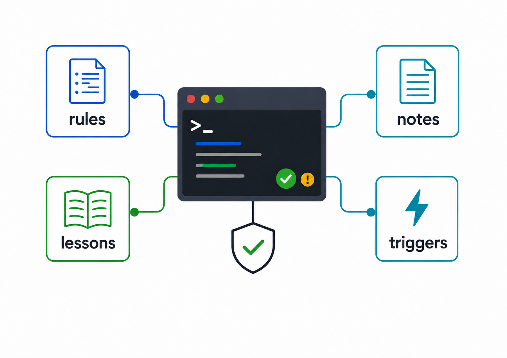

# Agent Rules in Action

<p align="center">
  
</p>

A hands-on demo repo for experiencing GitSense rules with a coding agent. Try it out and see how agents can be warned, guided, and blocked — just by asking.

## Quick Start

Clone the repo and start your agent:

```bash
git clone https://github.com/gitsense/gsc-rules-demos.git
cd gsc-rules-demos
```

### Pi

```bash
pi install npm:@gitsense/pi-brains
pi
```

Once Pi starts, initialize the brains:

```
/brains
```

This teaches the agent how to use `gsc` commands. Rules are enabled by default.

## What You'll Learn

- **Block risky operations** — Prevent agents from editing production configs without approval
- **Use notes on demand** — Teach agents how to interpret files with project-specific context
- **Inject context** — Provide format guidance when agents read specialized files
- **Show warnings** — Alert agents when working with auto-generated code
- **Intercept input** — Guide users toward correct agent commands
- **Run triggers in parallel** — Execute multiple safety checks concurrently

## See it in Action

Once your agent is running, try these prompts and see what happens.

### 1. Intercept a Command

**Try this:**

```
exit
```

**What happens:** The agent intercepts your input before it reaches the AI. You'll see a warning that `exit` isn't a valid command, and guidance to use `/quit` instead. No AI response is generated — the rule steps in first.

---

### 2. Read a Ledger File

**Try this:**

```
read data/accounting/q1.ledger
```

**What happens:** The agent blocks the read and tells you to review accounting notes first. These notes explain the ledger format and business context. Try the same prompt again — the second read succeeds because the instructions were already delivered.

---

### 3. Edit an Auto-Generated File

**Try this:**

```
edit src/generated/types.ts to add a nickname field
```

**What happens:** The agent warns you that this is an auto-generated file and suggests editing the source schema instead. The edit proceeds — it's a warning, not a block.

---

### 4. Edit a Production Config

**Try this:**

```
edit config/production.env to change APP_PORT to 9090
```

**What happens:** The agent blocks the edit with a message: "Production configuration changes require deployment approval." You'll need to set `AI_CONFIG_EDIT_APPROVED=true` in your environment to proceed.

---

### 5. Edit a Deployment Workflow

**Try this:**

```
edit .github/workflows/deploy.yml to add a logging step
```

**What happens:** Multiple rules fire at once. You'll see both a declarative instruction ("Deployment workflow changes require DevOps team review") and an executable trigger ("DEPLOYMENT WORKFLOW GUARD"). The edit is blocked until both are addressed.

---

### 6. Parallel Safety Checks

**Try this:**

```
edit src/parallel/checkout.ts to add a discount field
```

**What happens:** Three triggers run concurrently and complete in ~1.5 seconds (the longest trigger) instead of ~3 seconds (if they ran sequentially). You'll see notices from each one.

---

### 7. Edit Third-Party Code

**Try this:**

```
edit third_party/vendor-widget.js to add input validation
```

**What happens:** The edit completes, then a provenance entry is created tracking that an AI made changes to third-party code. Useful for audit trails.

## Creating Your Own Rules

The easiest way to create rules is to ask the agent:

```
add a rule that warns when editing test files in src/
```

```
create a rule that blocks edits to package.json unless TEST_MODE is set
```

The agent will create the rule, validate it, and walk you through how it works.

## License

Apache 2.0
